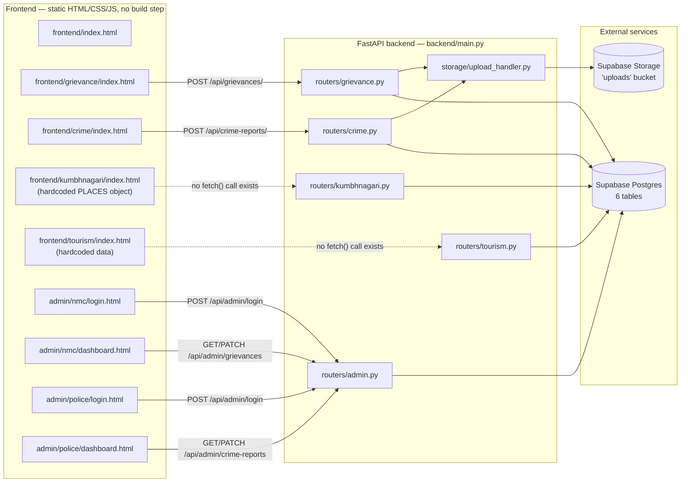
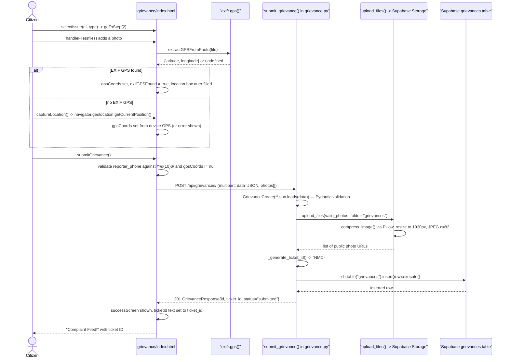
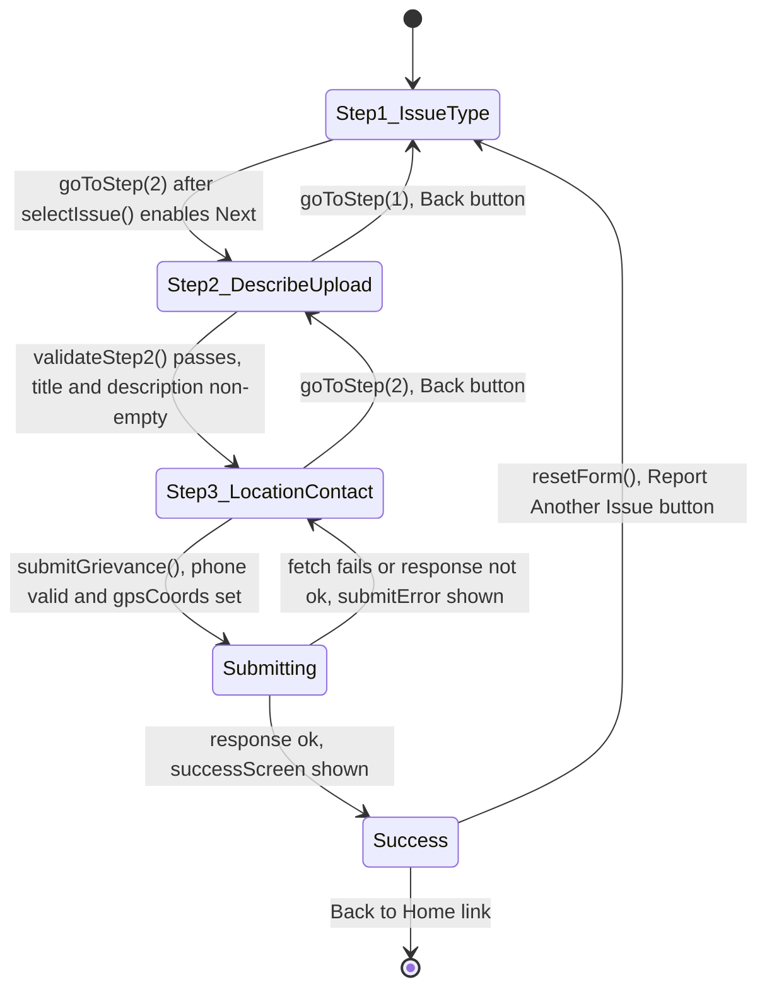
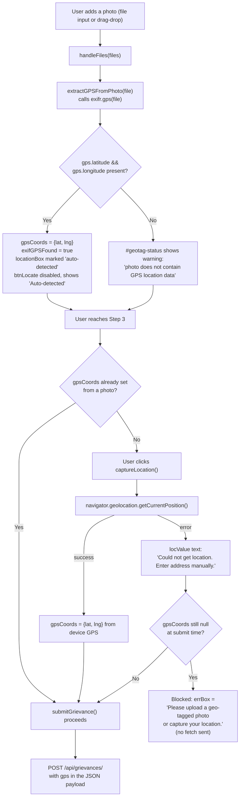

# Smart City Nashik Portal

A civic-services web app for Nashik, Maharashtra, split into a static
HTML/CSS/vanilla-JS frontend (`frontend/`) and a Python/FastAPI backend
(`backend/`) backed by Supabase (Postgres + Storage). The site exposes four
citizen-facing modules — grievance reporting, anonymous crime reporting, a
"Kumbhnagari" spiritual/tourism hub, and a "Bhatakanti" travel guide — plus a
role-based admin panel for NMC (municipal) and Police staff. Of the four
public modules, only Grievance and Crime actually call the backend API;
Kumbhnagari and Tourism render data that is hardcoded in their own
`<script>` blocks (see Status notes, item 3). Confirmed tech stack, read
directly from source: FastAPI 0.115 + Uvicorn, Pydantic v2, the `supabase-py`
client (Postgres + Storage), Pillow for server-side image compression,
`python-jose` + `passlib[bcrypt]` for admin JWT auth, and a frontend with no
framework, no bundler, and no `package.json` anywhere in the repo.

## 1. Setup

```bash
git clone https://github.com/omdesale777/smart-city-portal-nashik-v2.git
cd smart-city-portal-nashik-v2
```

**Frontend** — there is no build step. Serve `frontend/` with any static
file server (e.g. VS Code "Live Server", or `python -m http.server`) and
open `frontend/index.html`. The Vercel deploy config (`vercel.json`) only
routes `/` to `frontend/index.html`; everything else relies on Vercel's
default static-file serving.

**Backend**

```bash
cd backend
python3.11 -m venv venv
source venv/bin/activate        # Windows: venv\Scripts\activate
pip install -r requirements.txt
uvicorn main:app --reload --port 8000    # command taken from main.py's own docstring
```

Swagger UI is then at `http://localhost:8000/docs` (default FastAPI
behavior; not custom code).

### Environment variables actually read by the code

Verified by `grep -rn "os.environ" backend/`. Nothing else is read anywhere
in the Python code.

| Variable | Read in | Required? | Notes |
|---|---|---|---|
| `SUPABASE_URL` | `database.py` | Yes | Raises `RuntimeError` at first Supabase call if missing. |
| `SUPABASE_SERVICE_KEY` | `database.py`, `create_admin.py` | Yes (one of these two) | Legacy `service_role` (`eyJ...`) key. |
| `SUPABASE_SECRET_KEY` | `database.py`, `create_admin.py` | Yes (one of these two) | New `sb_secret_...` key format; checked as a fallback if `SUPABASE_SERVICE_KEY` is unset. |
| `SUPABASE_BUCKET` | `database.py` | No | Defaults to `"uploads"` via `get_bucket()`. |
| `APP_SECRET` | `routers/admin.py` | No, but should be | JWT signing secret. Defaults to the literal string `"change-me-in-production-32chars!!"` if unset — see Status notes. |

`database.py` loads `backend/.env.local` first, then `backend/.env`
(`load_dotenv(..., override=False)` for the second), so `.env.local` values
win. Neither file exists in the repo and there is no `.env.example` to copy.

## 2. Scripts

There is **no `package.json`** anywhere in this repo (confirmed:
`find . -name "package.json"` returns nothing), so there are no npm scripts
to list. The only "scripts" that exist are:

- `backend/create_admin.py` — one-off script to insert admin rows into
  Supabase's `admins` table with bcrypt-hashed passwords. Run with
  `python create_admin.py` after activating the venv. Its own docstring
  calls it `create_admins.py` (plural) even though the file on disk is
  `create_admin.py` (singular) — copy-pasting the docstring's usage example
  verbatim will fail.
- The `uvicorn main:app --reload --port 8000` command in `backend/main.py`'s
  module docstring, used to run the API locally.
- `backend/admin_setup.sql` and `backend/seed.sql` — not executable scripts,
  but SQL meant to be pasted into the Supabase SQL editor (see Configuration
  section).

## 3. Architecture



`main.py` registers all five routers under `/api/grievances`,
`/api/crime-reports`, `/api/kumbhnagari`, `/api/tourism`, and `/api/admin`,
plus `GET /` and `GET /health`. `KumbhR` and `TourR` are fully wired to the
database and are reachable if you call them directly (e.g. via `/docs`), but
no frontend page calls them — the dotted lines above are real: a
repo-wide `grep -n "fetch("` across `frontend/` turns up calls in
`grievance/index.html`, `crime/index.html`, and the two admin dashboards
only.

## 4. Request/logic flow — grievance submission

Traced through the real functions: `handleFiles` → `extractGPSFromPhoto`
(uses the `exifr` CDN library) → `captureLocation` (browser geolocation
fallback) → `submitGrievance` → FastAPI's `submit_grievance` →
`upload_files` → `_generate_ticket_id`.



The crime-reporting module (`crime/index.html` → `submit_crime_report` in
`routers/crime.py`) follows the same shape (JSON-in-`FormData`, optional
media upload, server-generated reference ID), with the added rule that
`reporter_phone` is forced to `None` server-side whenever
`is_anonymous=true`, regardless of what the client sends.

## 5. UI flow — grievance form wizard

State names below are the actual `currentStep` values and panel/element IDs
from `frontend/grievance/index.html`'s inline `<script>` (`goToStep`,
`validateStep2`, `submitGrievance`, `resetForm`).



Note that `Step3_LocationContact -> Submitting` is blocked client-side (the
transition never fires) if `gpsCoords` is still `null` — the code shows
`errBox.textContent = 'Please upload a geo-tagged photo or capture your
location.'` and returns early, without ever calling `fetch`.

## 6. GPS resolution — how `gpsCoords` gets set

This app-specific mechanic (auto-filling location from a photo's EXIF data)
is distinctive enough in the codebase to warrant its own diagram, traced
through `extractGPSFromPhoto`, `captureLocation`, and the guard inside
`submitGrievance`.



Removing the last remaining photo resets this state entirely
(`removePhoto()` clears `gpsCoords` and `exifGPSFound` back to their initial
values if `uploadedFiles.length === 0`), so a user who uploads then deletes
their only geotagged photo has to re-capture location from scratch.

## 7. Project structure

```
smart-city-portal-nashik-v2/
├── vercel.json                     # single route: "/" -> frontend/index.html
├── README.md
├── backend/
│   ├── main.py                     # FastAPI app, CORS, router registration, /, /health
│   ├── database.py                 # Supabase client (get_supabase, get_bucket), Tables enum, table DDL as a comment
│   ├── admin.py                    # 0-byte empty file — not imported anywhere, distinct from routers/admin.py
│   ├── create_admin.py             # one-off script: inserts bcrypt-hashed admin rows into Supabase
│   ├── admin_setup.sql             # SQL for `admins` table + RLS, pasted into Supabase SQL editor
│   ├── seed.sql                    # INSERT statements for hotels, spiritual_spots, spiritual_events, tourist_spots
│   ├── requirements.txt            # pinned Python deps (FastAPI, supabase, Pillow, python-jose, passlib, ...)
│   ├── runtime.txt                 # "python-3.11.9" (Render buildpack hint)
│   ├── models/
│   │   └── schemas.py              # all Pydantic request/response models for every module
│   ├── routers/
│   │   ├── grievance.py            # POST/GET /api/grievances
│   │   ├── crime.py                # POST/GET /api/crime-reports
│   │   ├── kumbhnagari.py          # GET /api/kumbhnagari/* (hotels, spiritual spots, events) — unused by frontend
│   │   ├── tourism.py              # GET /api/tourism/* (tourist spots, categories) — unused by frontend
│   │   └── admin.py                # JWT login + role-gated admin endpoints for NMC and Police
│   └── storage/
│       └── upload_handler.py       # Supabase Storage upload, Pillow compression, size limits
└── frontend/
    ├── index.html                  # homepage, links to all 4 modules + 2 admin logins
    ├── admin/
    │   ├── nmc/login.html          # POST /api/admin/login (role must be "nmc")
    │   ├── nmc/dashboard.html      # grievance table, filters, status updates
    │   ├── police/login.html       # POST /api/admin/login (role must be "police")
    │   └── police/dashboard.html   # crime report table, filters, status updates
    ├── assets/
    │   ├── css/style.css           # shared design tokens/utilities
    │   ├── css/responsive.css      # shared breakpoints
    │   └── js/
    │       ├── config.js           # resolves window.APP_CONFIG.API_BASE_URL
    │       ├── auth.js             # localStorage-based admin session helper (Auth.login/requireRole/fetch)
    │       ├── main.js             # shared Toast/API/Validate helpers, cursor, drop zone
    │       └── preloader.js        # self-injecting loading screen shown on window.load
    ├── grievance/index.html        # 3-step wizard; calls the API (see diagrams above)
    ├── crime/index.html            # 3-step wizard; calls the API
    ├── kumbhnagari/index.html      # hardcoded PLACES data object; no API calls
    └── tourism/index.html          # hardcoded tourist-spot data; no API calls
```

## 8. Configuration / key constants

Pulled directly from source, not from documentation:

| Constant | File | Value |
|---|---|---|
| `PROD_API_BASE_URL` / `DEV_API_BASE_URL` | `frontend/assets/js/config.js` | Both set to `https://smart-city-portal-nashik-v2.onrender.com` — identical, see Status notes. |
| `Tables` (table name constants) | `backend/database.py` | `GRIEVANCES="grievances"`, `CRIME_REPORTS="crime_reports"`, `HOTELS="hotels"`, `SPIRITUAL="spiritual_spots"`, `TOURIST_SPOTS="tourist_spots"`, `EVENTS="spiritual_events"` |
| `MAX_IMAGE_SIZE_MB` | `backend/storage/upload_handler.py` | `5` |
| `MAX_VIDEO_SIZE_MB` | `backend/storage/upload_handler.py` | `50` |
| `IMAGE_COMPRESS_QUALITY` | `backend/storage/upload_handler.py` | `82` (JPEG quality) |
| `IMAGE_MAX_DIMENSION` | `backend/storage/upload_handler.py` | `1920` px — images larger than this on either axis are downscaled |
| `JWT_ALGORITHM` | `backend/routers/admin.py` | `"HS256"` |
| `JWT_EXPIRE_HOURS` | `backend/routers/admin.py` | `8` |
| `VALID_GRIEVANCE_STATUSES` | `backend/routers/admin.py` | `{submitted, in_progress, resolved, rejected}` |
| `VALID_CRIME_STATUSES` | `backend/routers/admin.py` | `{received, under_review, investigating, closed, rejected}` |
| CORS `allow_origin_regex` | `backend/main.py` | `^(?:http://(?:localhost\|127\.0\.0\.1)(?::\d+)?\|https://[a-zA-Z0-9-]+\.vercel\.app)$` — plus the literal origin `"null"` for `file://` pages |
| `GRIEVANCE_ISSUE_TYPES` | `backend/models/schemas.py` | `{garbage, road, streetlight, tree, water, other}` |
| `INCIDENT_TYPES` | `backend/models/schemas.py` | `{theft, harassment, drugs, assault, suspicious, other}` |
| `TOURIST_CATEGORIES` | `backend/models/schemas.py` | `{fort, waterfall, adventure, nature, history}` |

## 9. API reference

All paths are relative to the API base URL (`window.APP_CONFIG.API_BASE_URL`
on the frontend). None of these endpoints are mounted under a version
prefix.

| Method | Path | Auth | Implemented in | Called by frontend? |
|---|---|---|---|---|
| GET | `/` | none | `main.py` | no (health check) |
| GET | `/health` | none | `main.py` | no (health check) |
| POST | `/api/grievances/` | none | `routers/grievance.py` | yes — `grievance/index.html` |
| GET | `/api/grievances/` | none | `routers/grievance.py` | no (docstring says "admin," but the admin dashboard actually uses `/api/admin/grievances` instead) |
| GET | `/api/grievances/{ticket_id}` | none | `routers/grievance.py` | no |
| POST | `/api/crime-reports/` | none | `routers/crime.py` | yes — `crime/index.html` |
| GET | `/api/crime-reports/` | none | `routers/crime.py` | no |
| GET | `/api/crime-reports/{ref_id}` | none | `routers/crime.py` | no |
| GET | `/api/kumbhnagari/hotels` | none | `routers/kumbhnagari.py` | no — see Status notes |
| GET | `/api/kumbhnagari/hotels/{hotel_id}` | none | `routers/kumbhnagari.py` | no |
| GET | `/api/kumbhnagari/spiritual` | none | `routers/kumbhnagari.py` | no |
| GET | `/api/kumbhnagari/spiritual/{spot_id}` | none | `routers/kumbhnagari.py` | no |
| GET | `/api/kumbhnagari/events` | none | `routers/kumbhnagari.py` | no |
| GET | `/api/tourism/spots` | none | `routers/tourism.py` | no — see Status notes |
| GET | `/api/tourism/spots/{spot_id}` | none | `routers/tourism.py` | no |
| GET | `/api/tourism/categories` | none | `routers/tourism.py` | no |
| POST | `/api/admin/login` | none (issues JWT) | `routers/admin.py` | yes — both login pages |
| GET | `/api/admin/me` | Bearer JWT | `routers/admin.py` | yes — `Auth.requireRole()` in `auth.js` |
| GET | `/api/admin/grievances` | Bearer JWT, role=`nmc` | `routers/admin.py` | yes — `admin/nmc/dashboard.html` |
| PATCH | `/api/admin/grievances/{id}` | Bearer JWT, role=`nmc` | `routers/admin.py` | yes |
| GET | `/api/admin/crime-reports` | Bearer JWT, role=`police` | `routers/admin.py` | yes — `admin/police/dashboard.html` |
| PATCH | `/api/admin/crime-reports/{id}` | Bearer JWT, role=`police` | `routers/admin.py` | yes |
| GET | `/api/admin/stats` | Bearer JWT (any role) | `routers/admin.py` | not observed being called from any dashboard's inline script |

## 10. Troubleshooting

Error strings below are copied from the source, not paraphrased.

- **`❌ Missing Supabase credentials.` (RuntimeError, on first request)** —
  `SUPABASE_URL` and either `SUPABASE_SERVICE_KEY` or `SUPABASE_SECRET_KEY`
  aren't set. `database.py` raises this from `get_supabase()`, which is only
  called lazily on the first DB-touching request, so the server will start
  fine and then 500 on the first real API call. Fix: set the vars in
  `backend/.env.local` (there is no `.env.example` to copy from — see Status
  notes).
- **`Cannot reach backend at <url>. Check that the backend is running, the
  URL is correct, and CORS allows this origin.`** — thrown by `Auth.login()`
  in `auth.js` when the login `fetch()` itself throws (network error, not an
  HTTP error status). Usually means the backend isn't running, or
  `window.APP_CONFIG.API_BASE_URL` (from `config.js`) doesn't match where the
  backend actually is.
- **`Network error — cannot reach server. Is the backend running?`** — the
  equivalent message in `grievance/index.html`'s `submitGrievance()`, shown
  specifically when `err.message === 'Failed to fetch'`.
  `crime/index.html` uses the same pattern.
  code.
- **`Invalid username or password.` (401)** — from `POST /api/admin/login`
  in `routers/admin.py`. Deliberately identical whether the username doesn't
  exist or the password is wrong (the code comments this as intentional).
- **`Invalid or expired token. Please log in again.` (401)** — from
  `_decode_token()` in `routers/admin.py` on any `JWTError` (expired,
  malformed, or wrong-secret token). The frontend's `Auth.fetch()` reacts to
  any 401 by clearing the session and redirecting to that role's login page.
- **`Access denied. This endpoint requires NMC admin role.` / `... Police
  admin role.` (403)** — from `require_nmc` / `require_police` in
  `routers/admin.py` when a valid token's `role` claim doesn't match the
  endpoint. This happens if an NMC admin's token is used against a police
  endpoint or vice versa.
- **`Access denied. This portal is for NMC admins only.` / `... POLICE
  admins only.`** — client-side check in `auth.js`'s `login()`, thrown if the
  backend's returned `role` doesn't match the `role` argument passed to
  `Auth.login()` on that particular login page.
- **`Image '<filename>' exceeds 5MB limit.` / `Video '<filename>' exceeds
  50MB limit.` (413)** — from `upload_files()` in `storage/upload_handler.py`,
  checked before compression. Video limit is not configurable per-request;
  `submit_crime_report()` hardcodes `compress_images=False` for videos so
  large videos are uploaded unmodified.
- **`Failed to save grievance to database.` / `Failed to save report to
  database.` (500)** — from the two submit endpoints when
  `sb.table(...).insert(row).execute()` returns no `.data`. This can also
  surface as an unhandled Supabase exception (e.g. a `ticket_id`/`ref_id`
  collision against the `UNIQUE` constraint) since neither generator checks
  for existing IDs before insert.
- **`Grievance '<id>' not found.` / `Report '<id>' not found.` / `Hotel not
  found.` / `Spiritual spot not found.` / `Tourist spot not found.` (404)** —
  straightforward "row not found for that filter" responses across the
  respective GET-by-id endpoints.
- **`Please upload a geo-tagged photo or capture your location.`** — not a
  server error at all; it's a client-side guard in `submitGrievance()` that
  blocks the `fetch()` call entirely if `gpsCoords` is still `null` (see the
  GPS resolution diagram above).

## 11. Status notes

Discrepancies between the existing `README.md` / code comments and what the
code actually does, confirmed by reading the source rather than trusting
either:

1. **Per-module `*-api.js` files described in the old README don't exist.**
   The previous README's "Project Structure" section lists
   `kumbhnagari-api.js`, `grievance-api.js`, `crime-api.js`, and
   `tourism-api.js` as separate files under each module folder. None of
   these files exist; all module logic (including all API calls) lives in a
   single inline `<script>` block at the bottom of each module's
   `index.html`.
2. **"No admin panel in this MVP" is stale; the admin panel is fully built.**
   The old README's Security section says "No admin panel in this MVP — add
   JWT/session-based auth before deploying admin routes publicly," and lists
   "Admin dashboard for NMC & Nashik Police" under Future Roadmap. Both are
   already implemented: `backend/routers/admin.py` has full JWT auth with
   bcrypt password hashing and role checks, and `frontend/admin/` has
   working login + dashboard pages for both roles.
3. **Kumbhnagari and Tourism backend routes are implemented but orphaned
   from the frontend.** `routers/kumbhnagari.py` and `routers/tourism.py`
   fully query their respective Supabase tables (`hotels`,
   `spiritual_spots`, `spiritual_events`, `tourist_spots` — all of which
   `backend/seed.sql` populates with real seed data), but no frontend page
   calls any of these endpoints. `frontend/kumbhnagari/index.html` and
   `frontend/tourism/index.html` instead render from a hardcoded in-page
   JavaScript object (`PLACES` in the kumbhnagari page). This is a fully
   working, deployable backend subsystem with zero live consumers.
4. **`backend/admin.py` is a dead, empty file.** It's 0 bytes, sits at the
   backend root (not inside `routers/`), and is never imported anywhere —
   distinct from the real, fully-implemented `backend/routers/admin.py`.
   Likely a leftover stub from before the router was moved into `routers/`.
5. **Old README's env var list doesn't match what the code reads.** It
   instructs setting `SUPABASE_ANON_KEY`, `APP_ENV`, and `FRONTEND_URL` in
   `.env.local`. A repo-wide search of `backend/*.py` for `os.environ` shows
   none of those three are ever read. The variables actually consumed are
   `SUPABASE_URL`, `SUPABASE_SERVICE_KEY` / `SUPABASE_SECRET_KEY`,
   `SUPABASE_BUCKET` (optional), and `APP_SECRET` (optional, insecure
   default — see next item).
6. **No `.env.example` file**, despite the old README's setup instructions
   saying `cp .env.example .env.local`.
7. **No `LICENSE` file**, despite the old README displaying a "License MIT"
   badge that links to `LICENSE`.
8. **JWT secret has an insecure hardcoded fallback.** `routers/admin.py`
   sets `JWT_SECRET = os.environ.get("APP_SECRET",
   "change-me-in-production-32chars!!")`. If `APP_SECRET` is never set in
   deployment, every admin token is signed with this fixed, publicly-visible
   string, meaning anyone with the source could forge admin tokens.
9. **Default admin passwords are committed to source control.**
   `backend/create_admin.py` hardcodes example passwords (e.g.
   `NMC@Nashik2024`) directly in the script, with a comment reminding the
   developer to change them — but the defaults themselves ship in the repo.
10. **CORS is broader than documented.** The old README's Security section
    claims CORS is "restricted to your specific Vercel frontend URL only."
    The actual regex in `main.py` allows *any* `https://*.vercel.app`
    subdomain, any `localhost`/`127.0.0.1` port, and the literal `"null"`
    origin (used by `file://` pages), not one specific URL.
11. **Frontend dev and prod point at the same backend by default.** In
    `frontend/assets/js/config.js`, `DEV_API_BASE_URL` and
    `PROD_API_BASE_URL` are set to the identical Render URL. Running the
    frontend on `localhost` does not, by itself, talk to a local backend —
    it talks to the deployed production API unless overridden via the
    `api-base-url` meta tag or `localStorage`.
12. **No Node.js/npm tooling despite npm-flavored deploy instructions.** The
    old README's deployment section says `npm i -g vercel` and `vercel` from
    inside `frontend/`. There is no `package.json` anywhere in the repo; the
    frontend is deployed as plain static files.
13. **Roadmap items beyond the admin panel remain unimplemented**, confirmed
    by finding no matching code: real-time status tracking via Supabase
    Realtime, a Marathi/English language toggle, a React Native mobile app,
    an AI chatbot, NMC/Police external API integration, an SOS feature, and
    push notifications. These are still aspirational, same as the old
    README states.
14. **Ticket/reference ID generation has no collision check.**
    `_generate_ticket_id()` (grievance.py) and `_generate_ref_id()`
    (crime.py) generate random IDs and insert immediately; the `UNIQUE`
    constraint on `ticket_id`/`ref_id` in the SQL schema means a (rare)
    collision would surface as a raw, unhandled Supabase error rather than a
    friendly retry.
